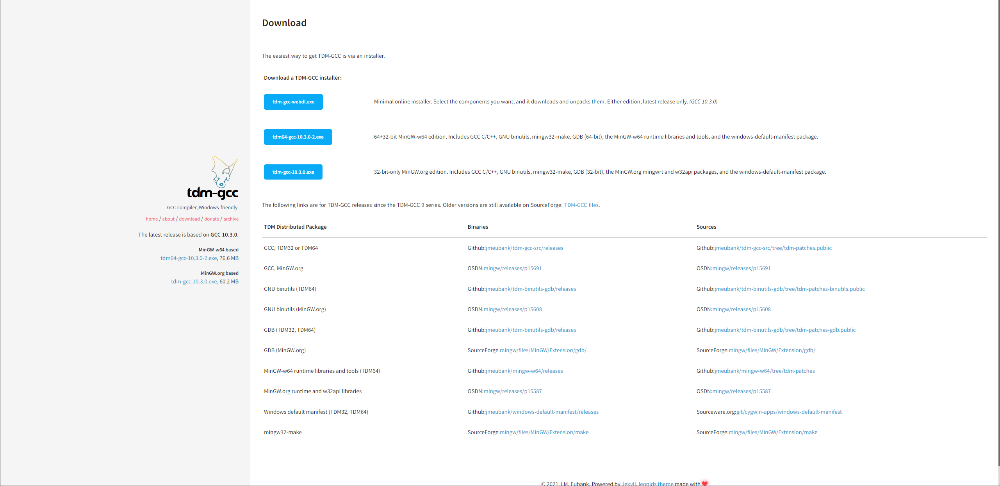
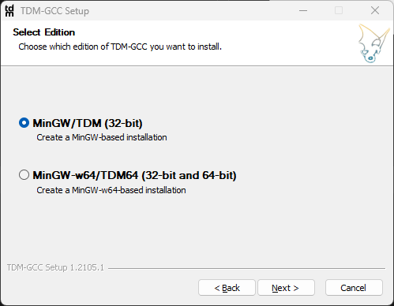
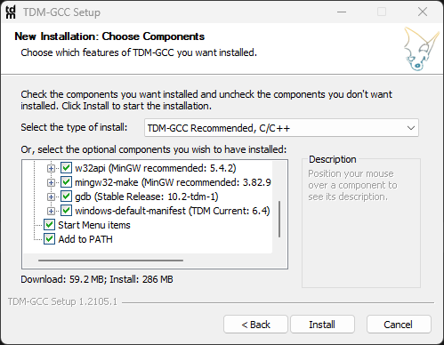

# TDM-GCC

매번 mingw로만 받았는데 이번에 새로 설치하려고 찾아보다가 더 간편하게 가능한 게 있어서 남겨두려 합니다.

## 다운로드

[TDM-GCC 다운로드 링크](https://jmeubank.github.io/tdm-gcc/download/)

위 링크에 들어가서 원하는 버전으로 받아주면 됩니다.
맨 위에 **tdm-gcc-webdl.exe**로 받으면 가장 최신 버전의 32-bit, 32+64-bit 선택해서 할 수 있습니다.

## 설치

실행하여 설치하려고 하는 버전 선택해주고 

맨 아래 "**Add to Path**" 선택해주면 따로 환경변수 설정할 필요가 없습니다.

간편하게 설치하여 활용할 수 있어서 c 컴파일러 설치할 일이 생기면 TDM-GCC로 설치할 것 같네요.