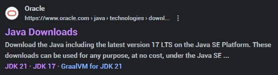
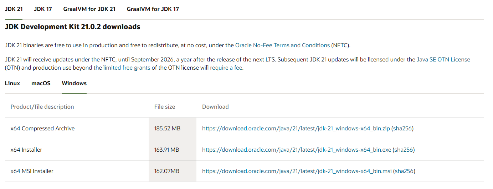

# Java 설치

자바를 다운받기 위해서는 구글에 **자바 다운로드**를 검색해서 [홈페이지](https://www.oracle.com/kr/java/technologies/downloads/)에 들어가면 됩니다.



들어가서 원하는 버전, 운영체제에 맞는 자바를 다운 받으면 됩니다. 



## 환경 변수 설정

그 이후에 해야하는게 환경 변수 설정인데 명령 프롬프트를 활용해서도 환경 변수 설정이 가능합니다.

명령 프롬프트를 열고 아래 2줄을 입력하면 끝입니다.

```cmd
setx JAVA_HOME "C:\Program Files\Java\jdk-21"
setx path "%path%;%JAVA_HOME%\bin"
```

이후에 java -version 을 입력하여 확인해보면 설치된 버전을 확인할 수 있을 겁니다.

