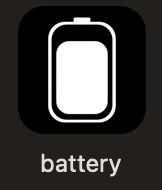
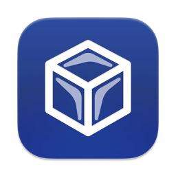
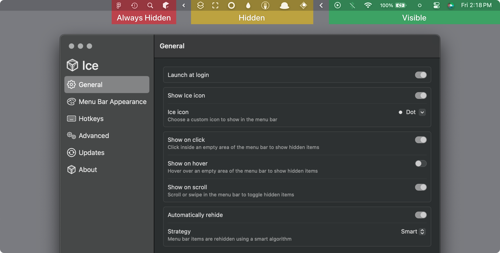

# 맥북 추천 앱
## Raycast
> ### [raycast.com](https://raycast.com)


맥북 사용 이전에 윈도우에서 flow launcher라는 맥북의 spotlight 같은 프로그램을 사용했기에 spotlight에 추가적인 플러그인 기능이 있는 앱을 찾아보았고 raycast를 발견하게 되었다. 

> [생산성에 진심인 자의 Raycast 세팅 엿보기 (for macOS)](https://velog.io/@wisepine/%EC%83%9D%EC%82%B0%EC%84%B1%EC%97%90-%EC%A7%84%EC%8B%AC%EC%9D%B8-%EA%B0%9C%EB%B0%9C%EC%9E%90%EC%9D%98-Raycast-%EC%84%B8%ED%8C%85-%EC%97%BF%EB%B3%B4%EA%B8%B0-for-macOS )

여기에서 볼 수 있듯이 단축키로 앱을 바로 실행할 수 있고, 클립보드 히스토리도 있고, 맥 기본으로 있는 키보드 대치 같은 기능도 자유롭게 설정하여 사용할 수 있다. 

무엇보다 여러 앱을 설치하고 나눠서 사용할 필요 없이 이 raycast만 설치해서 사용할 수 있다는게 가장 큰 장점이라고 생각한다.

#### 설치
`brew install --cask raycast`

---

## Battery
> ### [Battery](https://github.com/actuallymentor/battery)



배터리 충전 제한 앱으로 AlDente를 대체해서 활용할 수 있다. GUI보다 command-line으로 설정하는게 특징이다.

#### 설치
`brew install battery`

#### 사용법

```
# 배터리가 80%까지만 충전되고 너 높으면 충전되지 않도록 만듦
battery maintain 80
```

---

## Ice
### [Ice](https://github.com/jordanbaird/Ice)



Ice는 메뉴바 관리 앱으로 [Bartender](https://www.macbartender.com/)를 대체할 수 있는 앱이다. 아래 사진에서 볼 수 있듯이 메뉴바에 원하는 아이템만 남겨두게 정리 할 수 있다. 

설정창에 들어가서 General에서 Use Ice Bar를 On으로 바꾸면 메뉴바 아래에 숨겨진 아이콘이 나오게 할 수있고 Menu Bar Appearance에서 드래그로도 아이콘 숨김 설정이 가능하다. 그리고 메뉴바도 원하는데로 꾸밀 수 있어서 맥북 꾸미기 좋아하는 사람들도 좋아할 것 같다.



Todo에 다른 앱에 있는 기능들도 개발 대기중인 것으로 보여 업데이트가 기대된다.

#### 설치
`brew install jordanbaird-ice`

