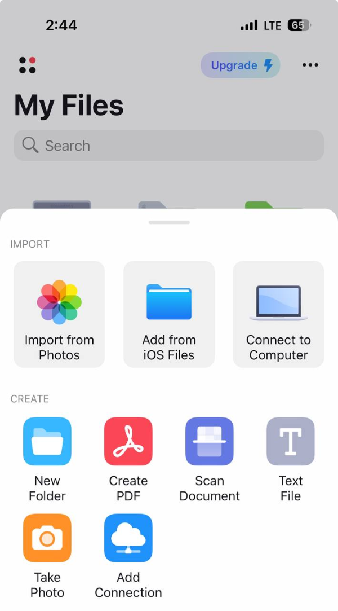
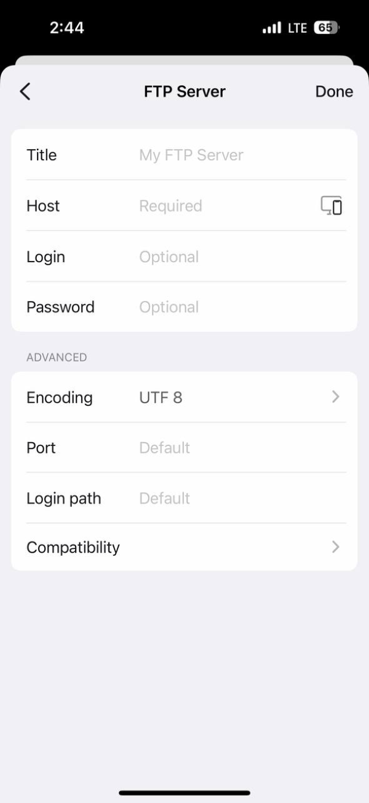
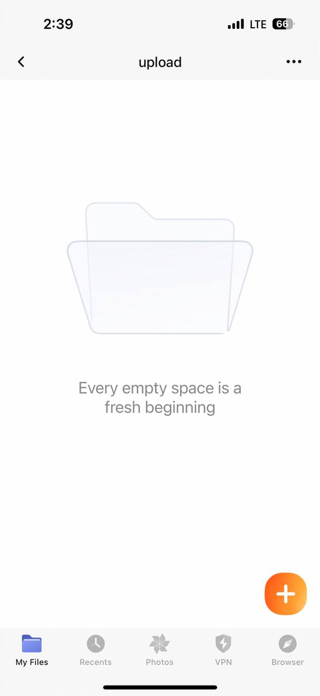
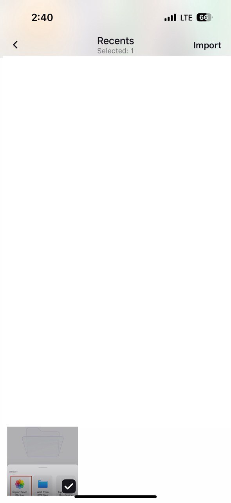
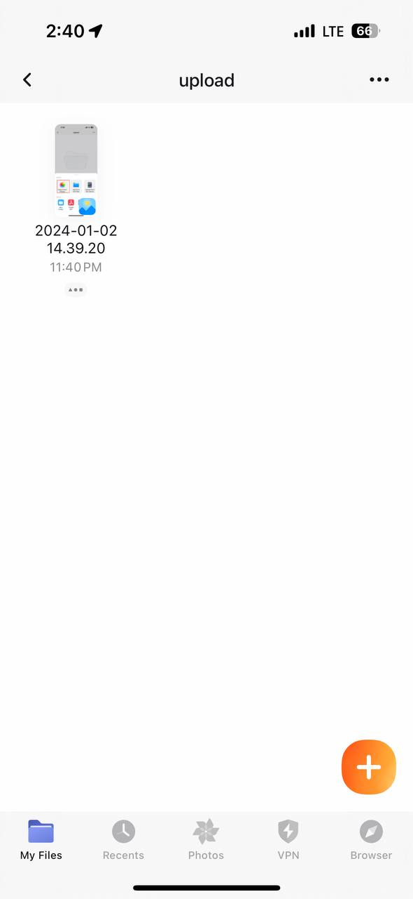

asus 공유기로 간이 nas 구성하면서 아이폰으로 사진 올리는 내용을 찾아보기 힘들더라구요.

# Documents
저는 Documents를 활용했습니다.

## ftp 연결

여기서 **Add connection** 누르고 

여기에 Host에 DDNS 적고 설정해둔 Login, password 작성하고 Done 누르면 연결은 끝입니다!

## 사진 업로드

사진을 올리려면 위에서 연결한 ftp에 들어가서 원하는 폴더에 들어가 **+** 버튼을 눌러줍니다.

그리고 원하는 사진 선택 후 Import 누르면 

선택한 사진이 올라가 있는 걸 볼 수 있습니다!

아이폰 사진 백업 용으로 잘 활용할 수 있을 것 같네요. 😊